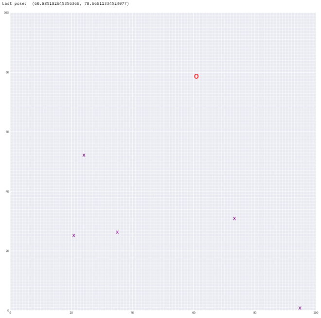

# Landmark-detection-and-robot-tracking
Apply Simultaneous Localization And Mapping (SLAM) to derive landmark positions and robot localization from measures made by the robot

# Description

In this project, we'll be localizing a robot in a 2D grid world. The basis for simultaneous localization and mapping (SLAM) is to gather information from a robot's sensors and motions over time, and then use information about measurements and motion to re-construct a map of the world.

In other words, using robot sensor measurements and movement, SLAM technique allows to create a map of an environment from only sensor and motion data gathered by a robot, over time. SLAM gives a way to track the location of a robot in the world in real-time and identify the locations of landmarks such as buildings, trees, rocks, and other world features. This is an active area of research in the fields of robotics and autonomous systems.

This project is the third project of UDACITY's Computer Vision nanodegree. The project is broken up into three notebooks and a couple of helper functions:
- Notebook 1 : Robot Moving and Sensing
- Notebook 2 : Omega and Xi, Constraints
- Notebook 3 : Landmark Detection and Tracking

# Installation

Download the repository and execute the notebooks.

# Results

- Ground truth of robot positions and landmark localizations

- Estimated landmark positions and robot positions. These are calculated using the SLAM approach from only motion and measurement data. SLAM gives us a way to both localize a robot and build up a map of its environment as a robot moves and senses in real-time. Note that both a measurement noise and a motion noise (representing the instruments and machine's precision gauge) are included in all measurements and collected data.

- Representation of the "world" mapped by the robot using detection measures as it moves.

